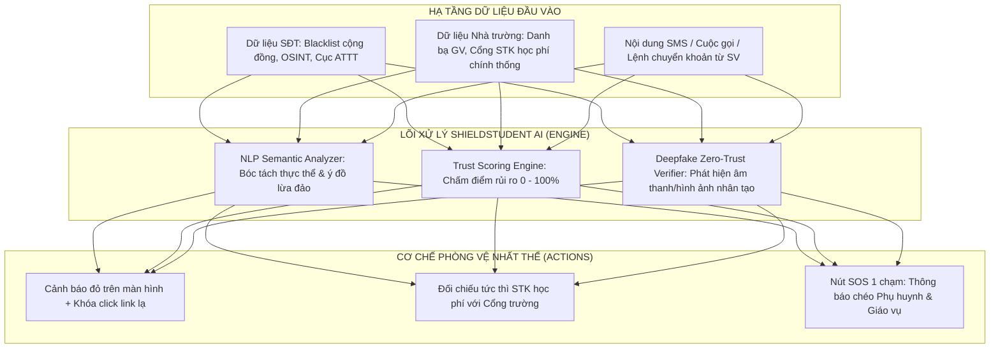

# BÁO CÁO NGHIÊN CỨU HỌC THUẬT: PHÂN TÍCH HỆ THỐNG PHÒNG VỆ LỪA ĐẢO TRỰC TUYẾN NHẮM VÀO SINH VIÊN
**Môn học**: Tư duy hệ thống (Chương 1)  
**Đề tài 9**: Lừa đảo trực tuyến nhắm vào sinh viên  
**Nhóm thực hiện**: Bài làm Tổ 4  

---

## TỔNG QUAN VÀ KHUNG LÝ THUYẾT HỆ THỐNG (CHƯƠNG 1)

Khoa học Hệ thống (General System Theory) định nghĩa: **Hệ thống** là một tập hợp các phần tử có mối quan hệ tương tác hữu cơ, phụ thuộc lẫn nhau và cùng hướng tới một hoặc nhiều mục tiêu xác định trong một môi trường nhất định.

Bài nghiên cứu này vận dụng 6 khái niệm trọng tâm của Chương 1:
1. **Mục tiêu (Objective / Goal)**: Trạng thái mong muốn mà hệ thống hướng tới.
2. **Phân hệ (Subsystem)**: Các bộ phận cấu thành thực hiện các chức năng chuyên biệt để phục vụ mục tiêu tổng thể.
3. **Liên kết (Linkage / Interaction)**: Dòng chảy thông tin, vật chất, năng lượng hoặc tài chính kết nối các phần tử.
4. **Tính nhất thể (Wholeness / Emergence / Systemic Integrity)**: Đặc tính mà toàn thể lớn hơn tổng số học các thành phần rời rạc ($1 + 1 > 2$ hoặc sụp đổ nếu thiếu liên kết).
5. **Tính thích nghi và Cơ chế phản hồi (Adaptability & Feedback Loops)**: Khả năng tự điều chỉnh trạng thái nội tại trước những biến động của môi trường.
6. **Yêu cầu chức năng / phi chức năng & Đánh giá rủi ro**: Nguyên lý kỹ thuật hệ thống khi thiết kế giải pháp công nghệ.

---

## PHẦN 1: PHÂN TÍCH “ĐƯỜNG DÂY LỪA ĐẢO” DƯỚI GÓC NHÌN HỆ THỐNG (NHIỆM VỤ 1)

### 1.1. Mục tiêu của hệ thống lừa đảo
Đường dây tội phạm trực tuyến vận hành theo mô hình tối ưu hóa lợi nhuận phi pháp:
$$\max (\text{Lợi nhuận chiếm đoạt}) \quad \text{và} \quad \min (\text{Dấu vết truy vết pháp lý}) \quad \text{trong} \quad t \to 0$$
- Mục tiêu ngắn hạn: Chiếm đoạt tiền nhanh từ các khoản tiền học phí, tiền sinh hoạt phí hoặc tiền tiết kiệm của nạn nhân.
- Mục tiêu dài hạn: Duy trì sự vô hình trước các công cụ giám sát an ninh mạng quốc gia.

### 1.2. Các phân hệ cấu thành (Subsystems)
Hệ thống đường dây lừa đảo không hoạt động tự phát mà được chuyên môn hóa cao độ thành 3 phân hệ tương tác chặt chẽ:

```mermaid
graph TD
    subgraph "HỆ THỐNG ĐƯỜNG DÂY LỪA ĐẢO"
        subgraph "Phân hệ 1: Săn tìm mục tiêu (Target Acquisition)"
            S1_1[Thu thập Data sinh viên: MXH, rò rỉ dữ liệu] --> S1_2[Phân loại: Tân sinh viên, tìm trọ, tìm việc]
            S1_2 --> S1_3[Phát tán mồi câu: SMS, Zalo, Tiktok, FB Ads]
        end

        subgraph "Phân hệ 2: Thao túng tâm lý (Social Engineering & AI)"
            S2_1[Kịch bản Việc nhẹ lương cao / Giả mạo học phí] --> S2_2[Mồi nhử: Trả thưởng nhỏ 50k - 200k]
            S2_2 --> S2_3[Tạo áp lực / Deepfake giả giọng, mặt người thân]
            S2_3 --> S2_4[Ép chuyển tiền vào thế chân / bảo lãnh]
        end

        subgraph "Phân hệ 3: Dòng tiền & Rửa tiền (Financial Exfiltration)"
            S3_1[Tài khoản ngân hàng rác 'Mule Accounts'] --> S3_2[Chia nhỏ dòng tiền < 10 triệu / giao dịch]
            S3_2 --> S3_3[Chuyển đổi qua Tiền số USDT / Cổng thanh toán quốc tế]
        end

        S1_3 --"Chuyển giao mục tiêu (Leads)"--> S2_1
        S2_4 --"Lệnh chuyển tiền thành công"--> S3_1
        S3_3 --"Phản hồi hiệu quả kịch bản (Feedback)"--> S1_1
    end
```



1. **Phân hệ Săn tìm mục tiêu (Target Acquisition Subsystem)**:
   - Chức năng: Tìm kiếm và lọc các "leads" tiềm năng. Thu thập số điện thoại, lớp học, quê quán qua các hội nhóm "K65 Tân sinh viên", "Tìm trọ sinh viên giá rẻ".
   - Công cụ: Tool cào dữ liệu tự động, chạy quảng cáo nhắm mục tiêu Facebook/Tiktok.
2. **Phân hệ Thao túng tâm lý & Tạo niềm tin (Social Engineering & Deepfake Subsystem)**:
   - Chức năng: Thiết lập niềm tin giả và đẩy nạn nhân vào trạng thái cảm xúc cực đoan (Lòng tham hoặc Nỗi sợ hãi tột cùng).
   - Kỹ thuật:
     - *Bẫy việc làm*: Trả hoa hồng sòng phẳng cho 2-3 nhiệm vụ đầu (tạo cảm giác an toàn), sau đó nâng vốn lên hàng triệu đồng rồi khóa rút tiền.
     - *Bẫy học phí*: Mạo danh cán bộ nhà trường, tạo website/biên lai chuyển tiền giả mạo, viện cớ "hệ thống lỗi cần nộp tài khoản phụ".
     - *Bẫy Deepfake*: Cắt ghép khuôn mặt và giọng nói cha mẹ/anh chị gọi video trong 5-10 giây giật lag viện cớ "tai nạn/cấp cứu khẩn cấp".
3. **Phân hệ Thu hoạch & Tẩu tán dòng tiền (Financial Exfiltration Subsystem)**:
   - Chức năng: Xóa sạch dấu vết tài chính trước khi nạn nhân kịp định thần báo án.
   - Cơ chế: Sử dụng mạng lưới tài khoản ngân hàng "rác" (thu mua từ người nghèo, sinh viên vô danh) chia nhỏ số tiền dưới 10 triệu đồng để lách sinh trắc học theo Quyết định 2345/QĐ-NHNN, chuyển ngay sang USDT trên các sàn giao dịch P2P.

### 1.3. Khả năng thích nghi và Vòng phản hồi (Adaptability & Feedback Loops)
Hệ thống này sở hữu **tính thích nghi cực kỳ linh hoạt (High Dynamic Adaptability)** nhờ vòng phản hồi ngắn:
- **Thích nghi theo thời gian (Chronological Adaptation)**: Tháng 9-10 (mùa nhập học: kịch bản học phí, bảo hiểm y tế, nhà trọ); Tháng 12-1 (cận Tết: kịch bản vé xe khách, việc làm thêm tại nhà).
- **Thích nghi công nghệ (Technological Adaptation)**: Khi nhà mạng siết chặt brandname SMS rác, chúng chuyển ngay sang tạo group kín Telegram, sử dụng SIM rác kích hoạt từ nước ngoài hoặc cuộc gọi OTT VoIP.
- **Thích nghi luật pháp (Regulatory Evasion)**: Khi cơ quan nhà nước yêu cầu quét khuôn mặt đối với giao dịch trên 10 triệu, chúng chia nhỏ số tiền hoặc dụ dỗ chính nạn nhân tự xác thực sinh trắc học gián tiếp.

---

## PHẦN 2: XÂY DỰNG SƠ ĐỒ HỆ THỐNG PHÒNG VỆ VÀ PHÂN TÍCH ĐIỂM GÃY (NHIỆM VỤ 2)

### 2.1. Sơ đồ tương tác 6 tác nhân phòng vệ
Hệ thống phòng vệ bao gồm 6 phần tử cốt lõi trong xã hội:

```mermaid
graph LR
    SV((Sinh viên))
    GD((Gia đình))
    NT((Nhà trường))
    NH((Ngân hàng))
    NM((Nhà mạng))
    CA((Công an))

    %% Các liên kết hiện hữu và điểm gãy
    SV <-->|Liên kết 1: Tâm lý e ngại, khoảng cách địa lý (ĐIỂM GÃY)| GD
    SV <-->|Liên kết 2: Thông tin một chiều, chậm phản hồi (ĐIỂM GÃY)| NT
    SV <-->|Liên kết 3: Chuyển tiền không xác thực chéo (ĐIỂM GÃY)| NH
    SV <-->|Liên kết 4: Nhận cuộc gọi rác, thiếu cảnh báo ngữ cảnh| NM
    SV -->|Liên kết 5: Tố giác sau khi đã mất tiền (Trễ pha)| CA

    CA <-->|Liên kết 6: Quy trình công văn xác minh mất nhiều ngày (ĐIỂM GÃY)| NH
    CA <-->|Liên kết 7: Chặn dải SIM rác sau báo cáo| NM
    NT <-->|Liên kết 8: Tuyên truyền học đường| CA
    GD <-->|Liên kết 9: Chu cấp tài chính| NH

    classDef broken stroke:#f43f5e,stroke-width:3px,stroke-dasharray: 5 5;
    classDef strong stroke:#10b981,stroke-width:2px;
```

### 2.2. Phân tích các Điểm gãy liên kết (Linkage Vulnerabilities)

| Liên kết | Bản chất liên kết | Biểu hiện điểm gãy (Điểm yếu) | Hậu quả hệ thống |
|:---|:---|:---|:---|
| **Sinh viên $\leftrightarrow$ Gia đình** | Liên kết cảm xúc, tài chính và cố vấn | Tâm lý sợ bị mắng; sinh viên năm nhất muốn chứng tỏ bản thân tự lập; khoảng cách địa lý xa xôi. | Kẻ lừa đảo dễ dàng cô lập nạn nhân ("Không được nói cho ai biết"). |
| **Sinh viên $\leftrightarrow$ Nhà trường** | Liên kết quy chế, hướng dẫn và dịch vụ sinh viên | Thông báo đào tạo mang tính hành chính tĩnh; không có kênh phản hồi khẩn cấp 24/7 để xác minh STK học phí. | Sinh viên tin vào thông báo giả mạo có logo trường đóng dấu đỏ scan. |
| **Ngân hàng $\leftrightarrow$ Công an** | Liên kết pháp lý, giám sát và phong tỏa tài sản | Độ trễ thủ tục hành chính: Công văn phong tỏa tài khoản mất từ 24h đến 7 ngày làm việc. | Tội phạm đã tẩu tán tiền trong vòng 3 phút qua sàn quốc tế. Tiền mất không thể thu hồi. |
| **Nhà mạng $\leftrightarrow$ Sinh viên** | Liên kết hạ tầng viễn thông | Chưa có cơ chế nhận diện ngữ cảnh cuộc gọi thời gian thực để cảnh báo trên màn hình chuông reo. | Sinh viên nghe máy trong trạng thái hoàn toàn bất ngờ và bị dẫn dụ. |

---

## PHẦN 3: VÌ SAO CẢNH BÁO RỜI RẠC CHƯA ĐỦ? (TÍNH NHẤT THỂ - NHIỆM VỤ 3)

### 3.1. Khái niệm Tính nhất thể (Wholeness / Systemic Emergence)
Trong Lý thuyết Hệ thống, **Tính nhất thể** khẳng định rằng:
> *"Một hệ thống không phải là phép cộng đơn giản của các phần tử riêng rẽ, mà là một thực thể hữu cơ. Thuộc tính phòng vệ của toàn hệ thống (Systemic Defense) chỉ xuất hiện (emerges) khi có sự tương tác phối hợp đồng bộ và tức thời giữa các phần tử cấu thành."*

Nếu xem xét phương trình:
$$\text{Hiệu quả phòng vệ tổng thể} \neq E_{\text{SV}} + E_{\text{GD}} + E_{\text{NT}} + E_{\text{NH}} + E_{\text{NM}} + E_{\text{CA}}$$

Khi các cảnh báo diễn ra **rời rạc, đơn lẻ**:
$$\text{Hiệu quả thực tế} < \sum E_i \quad \text{(Triệt tiêu lẫn nhau do quá tải thông tin)}$$

### 3.2. Cơ chế thất bại của cảnh báo rời rạc
1. **Hiện tượng ốc đảo dữ liệu (Information Silos)**:
   - Nhà trường chỉ biết danh sách sinh viên nhưng không biết số điện thoại nào đang bị spam.
   - Nhà mạng thấy lưu lượng cuộc gọi bất thường nhưng không biết nội dung có phải mạo danh giáo vụ hay không.
   - Ngân hàng thấy giao dịch chuyển tiền nhưng không biết sinh viên đang bị thao túng tâm lý qua Telegram.
2. **Khai thác "Khoảng trống liên kết" (Exploiting Linkage Gaps)**:
   - Kẻ lừa đảo không bao giờ tấn công vào "tường thành kiên cố" của từng bên (không hack ngân hàng, không tấn công server nhà trường).
   - Chúng tấn công vào **vùng giao thoa không ai quản lý**: cuộc gọi viễn thông OTT dẫn dụ vào cổng thanh toán ngân hàng chuyển tiền học phí giả danh nhà trường.
3. **Quá tải nhận thức của sinh viên (Cognitive Overload & Warning Fatigue)**:
   - Nhận quá nhiều tin nhắn cảnh báo chung chung từ Bộ TT&TT, Ngân hàng, Nhà trường khiến sinh viên nảy sinh tâm lý thờ ơ (bấm "Đã hiểu" hoặc xóa đi mà không đọc kỹ nội dung).

---

## PHẦN 4: THIẾT KẾ Ý TƯỞNG CÔNG CỤ AI CẢNH BÁO: "SHIELDSTUDENT AI" (NHIỆM VỤ 4)

Nhóm đề xuất giải pháp kỹ thuật: **ShieldStudent AI** – Nền tảng trợ lý an toàn số hợp nhất, đóng vai trò là "chất keo kết nối" tái lập Tính nhất thể cho hệ thống phòng vệ.



### 4.1. Yêu cầu chức năng (Functional Requirements)
1. **Module Phân tích số điện thoại & Tra cứu nguồn mở**:
   - Tự động đối chiếu số gọi đến với kho dữ liệu số lừa đảo quốc gia, mạng xã hội và báo cáo cộng đồng.
   - Phân tích mẫu đầu số quốc tế (+84 ảo, mã vùng lạ, VoIP).
2. **Module Phân tích ngữ nghĩa tin nhắn (NLP Semantic Message Analyzer)**:
   - Quét nội dung văn bản (SMS, Zalo, Telegram, Messenger).
   - Nhận diện các mẫu bẫy tâm lý: Từ khóa khẩn cấp ("khóa tài khoản trong 2h", "đối soát"), hứa hẹn bất thường ("lương 500k-1tr/ngày", "hoa hồng 30%"), dọa nạt tố tụng.
3. **Module Xác thực học phí & Tài khoản thụ hưởng**:
   - Tích hợp danh sách trắng (Whitelist) số tài khoản chính thống của trường đại học.
   - Khi phát hiện tin nhắn yêu cầu nộp học phí, hệ thống tự động kiểm tra số tài khoản có thuộc danh mục nhà trường công bố hay không.
4. **Module Kiểm định Deepfake & Cuộc gọi giả mạo (Zero-Trust Call)**:
   - Cung cấp kịch bản kiểm tra nhanh cho sinh viên: Hướng dẫn yêu cầu người gọi quay góc nghiêng 90 độ, vẫy tay trước camera, hoặc hỏi 1 câu hỏi bí mật cá nhân chỉ gia đình biết.
5. **Cơ chế Cảnh báo chéo (Cross-party Emergency Alert)**:
   - Khi rủi ro đạt mức "Báo động đỏ" ($\ge 85\%$), ứng dụng kích hoạt nút SOS gửi tin nhắn khẩn cấp kèm định vị và bằng chứng âm thanh/hình ảnh tới người thân đã đăng ký trước.

### 4.2. Yêu cầu phi chức năng (Non-functional Requirements)
1. **Độ chính xác (Accuracy & Performance Metrics)**:
   - **Precision (Độ chuẩn xác)** $\ge 96\%$: Giảm thiểu tối đa việc báo động nhầm (False Positive) gây phiền toái cho sinh viên.
   - **Recall (Độ nhạy)** $\ge 98\%$: Bắt trọn hầu hết các kịch bản lừa đảo nguy hiểm, đặc biệt là kịch bản học phí và việc làm.
2. **Độ trễ thời gian thực (Real-time Latency)**:
   - Thời gian phân tích và đưa ra cảnh báo trên màn hình $< 1.2$ giây để sinh viên kịp thời phản xạ.
3. **Bảo mật và Quyền riêng tư (Privacy & Data Protection)**:
   - **Xử lý cục bộ trên thiết bị (On-Device Inference)**: Toàn bộ quá trình quét ngữ nghĩa văn bản được thực hiện bởi mô hình nén (Lightweight Tiny-BERT / MobileBERT) ngay trên chip điện thoại của sinh viên, không tải dữ liệu tin nhắn riêng tư lên máy chủ đám mây.
   - **Tuân thủ pháp luật**: Triệt để tuân thủ Nghị định 13/2023/NĐ-CP về bảo vệ dữ liệu cá nhân.
4. **Tính khả dụng và Trọng lượng nhẹ (Usability & Footprint)**:
   - Thiết kế dạng Web App / PWA (Progressive Web App) để sinh viên không cần tải app cồng kềnh, hoạt động mượt mà trên mọi dòng điện thoại iOS / Android giá rẻ.

### 4.3. Đánh giá rủi ro và Hạn chế hệ thống (Risk Assessment & Limitations)

| Rủi ro hệ thống | Mức độ rủi ro | Bản chất rủi ro | Biện pháp kiểm soát & Giảm thiểu |
|:---|:---:|:---|:---|
| **Tâm lý ỷ lại vào AI (Over-reliance)** | **Cao** | Sinh viên phụ thuộc 100% vào app, mất phản xạ tự cảnh giác; dễ sập bẫy các kịch bản lừa đảo mới (Zero-day Scam) mà AI chưa cập nhật. | Triết lý **"Human-in-the-loop"**: AI chỉ cung cấp khuyến nghị và hướng dẫn kiểm chứng, quyền quyết định và thao tác cuối cùng luôn thuộc về người dùng. |
| **Cảnh báo sai (False Positive)** | **Trung bình** | Gắn cờ nhầm tin nhắn khẩn cấp của giảng viên, thông báo học bổng chính đáng là lừa đảo. | Thiết lập cơ chế White-list (Danh bạ trắng) được xác thực chữ ký số bởi Nhà trường và cơ sở đào tạo. |
| **Tấn công đối kháng (Adversarial AI Attacks)** | **Cao** | Kẻ lừa đảo sử dụng Prompt Injection, chèn ký tự Unicode ẩn hoặc đổi biến thể từ ngữ để vượt qua bộ lọc NLP. | Ứng dụng cơ chế Học liên kết (Federated Learning) để liên tục cập nhật mẫu tấn công mới từ cộng đồng mà không xâm phạm dữ liệu cá nhân. |
| **Chi phí hạ tầng & Dữ liệu rác** | **Thấp** | Kẻ xấu spam báo cáo số điện thoại giả mạo để phá hoại cơ sở dữ liệu tín nhiệm cộng đồng. | Áp dụng thuật toán cân quyền (Reputation-based Crowdsourcing): Điểm báo cáo của tài khoản sinh viên đã xác thực email trường (.edu.vn) có trọng số tin cậy cao hơn. |

---

## KẾT LUẬN & ĐỀ XUẤT CHÍNH SÁCH

Nghiên cứu về lừa đảo trực tuyến nhắm vào sinh viên dưới góc độ Khoa học Hệ thống khẳng định một nguyên lý then chốt: **Không thể giải quyết một vấn đề mang tính hệ thống bằng các nỗ lực cá nhân phân mảnh.**

Để bảo vệ tân sinh viên toàn diện, cần đồng thời triển khai:
1. **Về kỹ thuật**: Triển khai công cụ AI trợ lý (như ShieldStudent AI) để lấp đầy các khoảng trống thông tin thời gian thực.
2. **Về thể chế liên kết**: Thiết lập cơ chế liên thông phản ứng nhanh 3 bên (Nhà trường - Ngân hàng - Công an địa phương) cho phép tạm khóa tài khoản nghi vấn trong 15 phút đầu phát sinh giao dịch.
3. **Về giáo dục**: Đưa học phần "An toàn số và Tư duy Hệ sinh thái" vào tuần sinh hoạt công dân đầu khóa cho 100% tân sinh viên.
